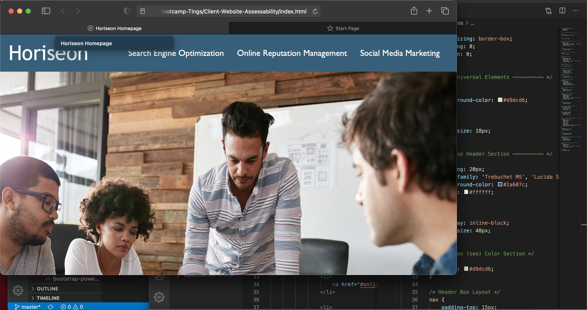

# Client-Website-Assessability

## Client Website Link
https://jaclay1994.github.io/Client-Website-Assessability/

## Goals

* Optimizing HTML and CSS syntax 
* Adding accessibility to allow readability to visitors
* Repairing Links

## Ticket Summary

* The website's original structure was cramped and cluttered. With spacing out the semantic tags, viewing the HTML is easier seperate and more defined for further development. Div tag elements were replaced with semantics to allow for flow layout and CSS was grouped together to follow the HTML structure. Comments have been placed throughout each code file to give more clarity on syntax structure. One link was fixed and is now active. Functionality was retained while adding alt image descriptions for accessibility. Font has been changed to allow reading more visibility of text content.

## Contact Info
jaclay94@gmail.com | 678-836-5753 | Atlanta, GA 
LinkedIn: https://www.linkedin.com/in/julian-clay-6a2bb71ba/
Github: https://github.com/jaclay1994

MIT License

Copyright (c) [2021] [Julian_Clay]

Permission is hereby granted, free of charge, to any person obtaining a copy
of this software and associated documentation files (the "Software"), to deal
in the Software without restriction, including without limitation the rights
to use, copy, modify, merge, publish, distribute, sublicense, and/or sell
copies of the Software, and to permit persons to whom the Software is
furnished to do so, subject to the following conditions:

The above copyright notice and this permission notice shall be included in all
copies or substantial portions of the Software.

THE SOFTWARE IS PROVIDED "AS IS", WITHOUT WARRANTY OF ANY KIND, EXPRESS OR
IMPLIED, INCLUDING BUT NOT LIMITED TO THE WARRANTIES OF MERCHANTABILITY,
FITNESS FOR A PARTICULAR PURPOSE AND NONINFRINGEMENT. IN NO EVENT SHALL THE
AUTHORS OR COPYRIGHT HOLDERS BE LIABLE FOR ANY CLAIM, DAMAGES OR OTHER
LIABILITY, WHETHER IN AN ACTION OF CONTRACT, TORT OR OTHERWISE, ARISING FROM,
OUT OF OR IN CONNECTION WITH THE SOFTWARE OR THE USE OR OTHER DEALINGS IN THE
SOFTWARE.